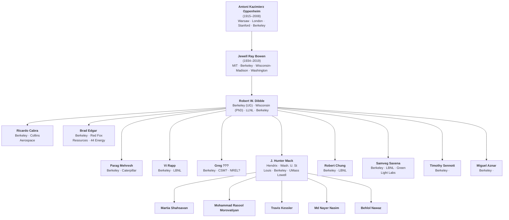

```mermaid
graph TD
    A["<b>Antoni Kazimierz Oppenheim</b><br/>(1915–2008)<br/>Warsaw · London · Stanford · Berkeley"]

    B["<b>Jewell Ray Bowen</b><br/>(1934–2019)<br/>MIT · Berkeley · Wisconsin-Madison · Washington"]

    C["<b>Robert W. Dibble</b><br/>Berkeley (UG) · Wisconsin (PhD) · LLNL · Berkeley"]

    D1["<b>Ricardo Cabra</b><br/> Berkeley · Collins Aerospace"]
    D2["<b>Parag Mehresh</b><br/> Berkeley · Caterpillar"]
    D3["<b>Vi Rapp</b><br/> Berkeley · LBNL"]
    D4["<b>Greg ???</b><br/> Berkeley · CSM? · NREL?"]
    D0["<b>J. Hunter Mack</b><br/> Hendrix · Wash. U. St Louis · Berkeley · UMass Lowell"]
    D5["<b>Brad Edgar </b><br/> Berkeley · Red Fox Resources · 44 Energy"]
    D6["<b>Robert Chung</b><br/> Berkeley · LBNL"]
    D7["<b>Samveg Saxena</b><br/> Berkeley · LBNL · Green Light Labs"]
    D8["<b>Timothy Sennott</b><br/> Berkeley · "]
    D9["<b>Miguel Aznar</b><br/> Berkeley · "]

    E["<b>Martia Shahsavan</b>"]
    F["<b>Mohammad Rasool Morovatiyan</b>"]
    G["<b>Travis Kessler</b>"]
    H["<b>Md Nayer Nasim</b>"]
    I["<b>Behlol Nawaz</b>"]

    A ---> B
    B ---> C

    C ---> D0
    C --> D1
    C ---> D2
    C ---> D3
    C ---> D4
    C --> D5
    C ---> D6
    C ---> D7
    C ---> D8
    C ---> D9

    D0 ---> E
    D0 ---> F
    D0 ---> G
    D0 ---> H
    D0 ---> I
```
