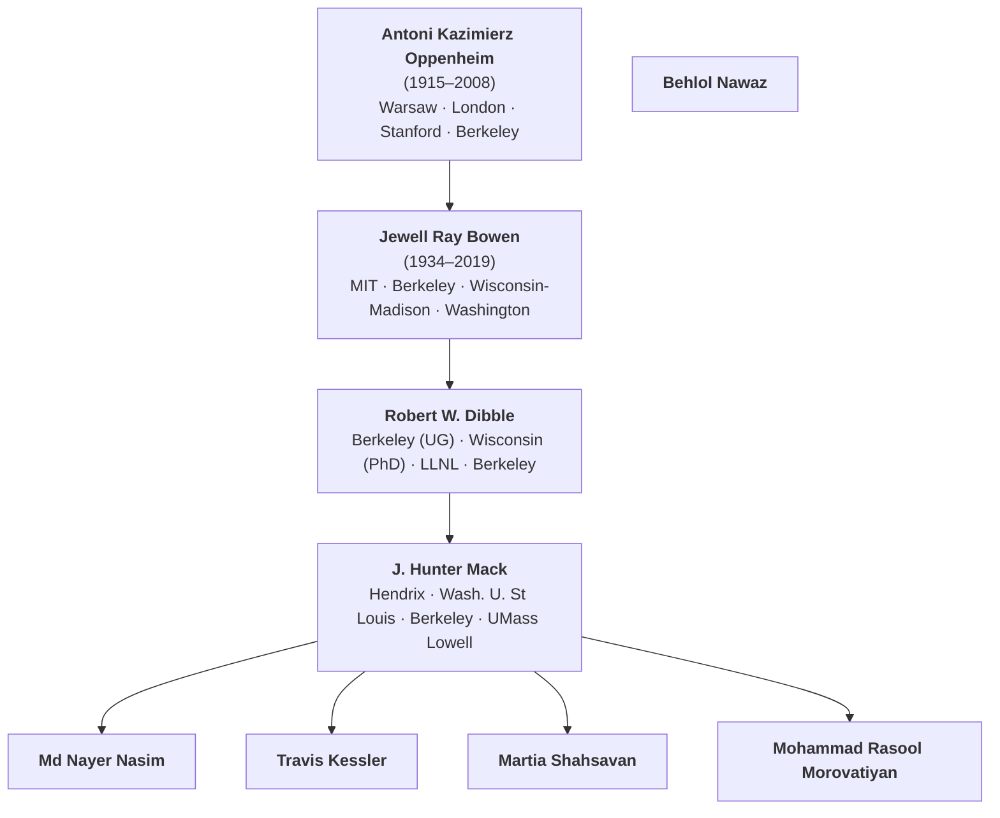

```mermaid
graph TD
    A["<b>Antoni Kazimierz Oppenheim</b><br/>(1915–2008)<br/>Warsaw · London · Stanford · Berkeley"]

    B["<b>Jewell Ray Bowen</b><br/>(1934–2019)<br/>MIT · Berkeley · Wisconsin-Madison · Washington"]

    C["<b>Robert W. Dibble</b><br/>Berkeley (UG) · Wisconsin (PhD) · LLNL · Berkeley"]

    D["<b>J. Hunter Mack</b><br/>Hendrix · Wash. U. St Louis · Berkeley · UMass Lowell"]

    E["<b>Md Nayer Nasim</b>"]
    F["<b>Travis Kessler</b>"]
    G["<b>Martia Shahsavan</b>"]
    H["<b>Mohammad Rasool Morovatiyan</b>"]
    I["<b>Behlol Nawaz</b>"]

    A --> B
    B --> C
    C --> D
    D --> E
    D --> F
    D --> G
    D --> H
```
