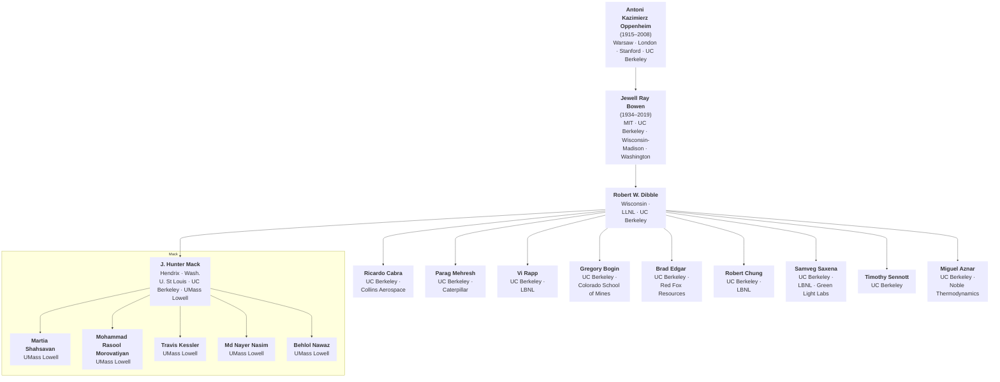

```mermaid
%%{init: {"flowchart": {"curve":"basis"}}}%%
flowchart TD
    A["<b>Antoni Kazimierz Oppenheim</b><br/>(1915–2008)<br/>Warsaw · London · Stanford · UC Berkeley"]

    B["<b>Jewell Ray Bowen</b><br/>(1934–2019)<br/>MIT · UC Berkeley · Wisconsin-Madison · Washington"]

    C["<b>Robert W. Dibble</b><br/> Wisconsin · LLNL · UC Berkeley"]

    D0["<b>J. Hunter Mack</b><br/> Hendrix · Wash. U. St Louis · UC Berkeley · UMass Lowell"]
    D1["<b>Ricardo Cabra</b><br/> UC Berkeley · Collins Aerospace"]
    D2["<b>Parag Mehresh</b><br/> UC Berkeley · Caterpillar"]
    D3["<b>Vi Rapp</b><br/> UC Berkeley · LBNL"]
    D4["<b>Gregory Bogin</b><br/> UC Berkeley · Colorado School of Mines"]
    D5["<b>Brad Edgar </b><br/> UC Berkeley · Red Fox Resources"]
    D6["<b>Robert Chung</b><br/> UC Berkeley · LBNL"]
    D7["<b>Samveg Saxena</b><br/> UC Berkeley · LBNL · Green Light Labs"]
    D8["<b>Timothy Sennott</b><br/> UC Berkeley"]
    D9["<b>Miguel Aznar</b><br/> UC Berkeley · Noble Thermodynamics"]

    E1["<b>Martia Shahsavan</b><br/> UMass Lowell"]
    E2["<b>Mohammad Rasool Morovatiyan</b><br/> UMass Lowell"]
    E3["<b>Travis Kessler</b><br/> UMass Lowell"]
    E4["<b>Md Nayer Nasim</b><br/> UMass Lowell"]
    E5["<b>Behlol Nawaz</b><br/> UMass Lowell"]

    A ---> B
    B ---> C

    C ---> D0
    C ---> D1
    C ---> D2
    C ---> D3
    C ---> D4
    C ---> D5
    C ---> D6
    C ---> D7
    C ---> D8
    C ---> D9

    subgraph Mack
    D0 ---> E1
    D0 ---> E2
    D0 ---> E3
    D0 ---> E4
    D0 ---> E5
    end

classDef noBorder stroke:none,stroke-width:0px,fill:#None,font-size:24px;
class A,B,C,D0,D1,D2,D3,D4,D5,D6,D6,D7,D8,D9,E1,E2,E3,E4,E5, noBorder
```